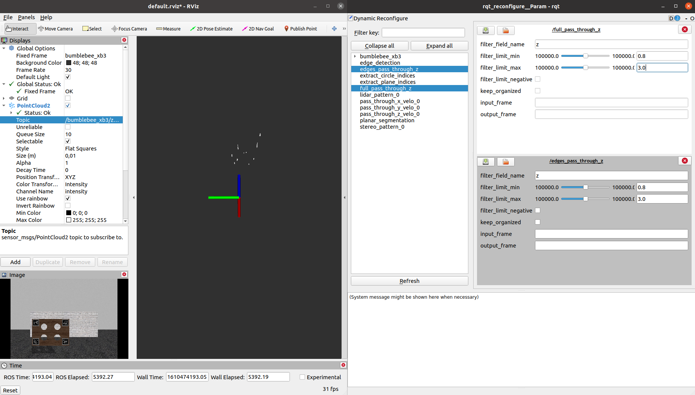
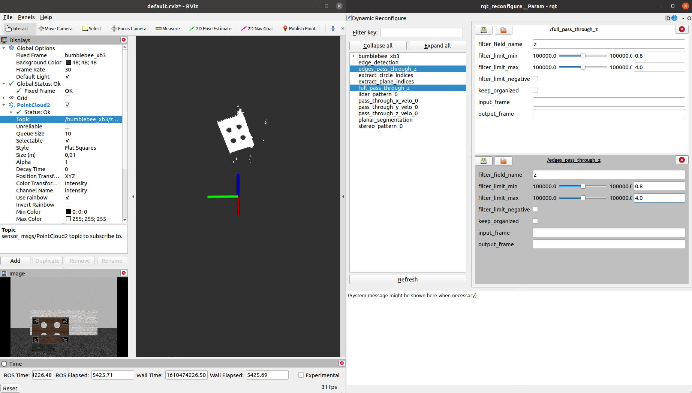
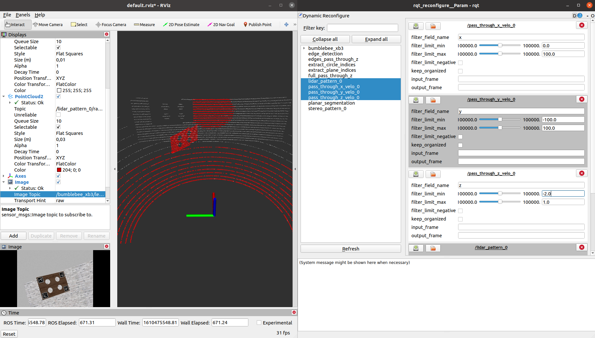
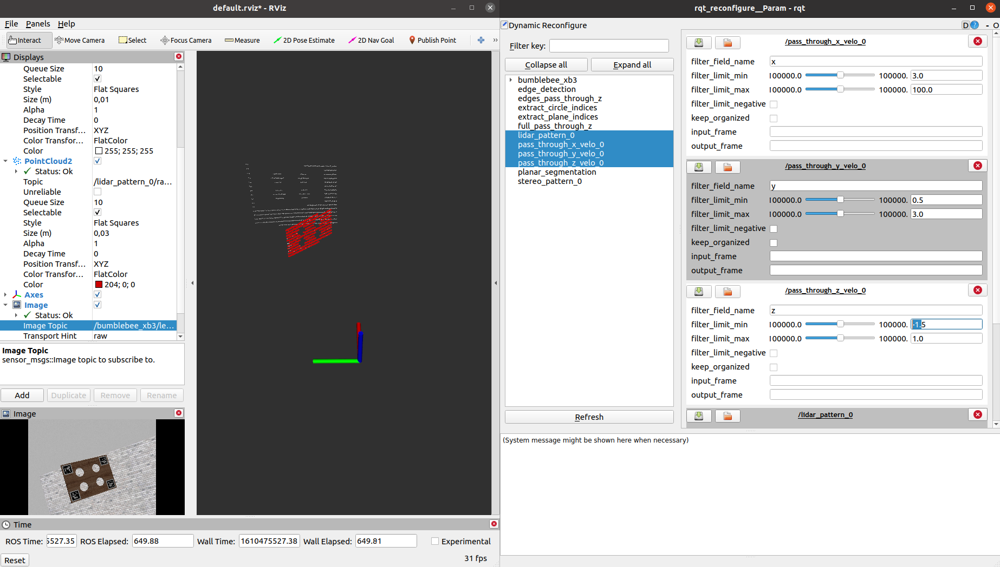

# User guide: How to calibrate your sensors
*Velo2cam_calibration* is a tool to obtain the extrinsic parameters expressing the relative pose of a pair of sensors. Each of these sensors can be a monocular camera, a stereo camera, or a lidar scanner.

# Setup #
First, you must identify the topics delivered by the drivers of the sensors to be calibrated. In particular, velo2cam_calibration expects the following inputs:
* Monocular: an image ([sensor_msgs/Image](http://docs.ros.org/api/sensor_msgs/html/msg/Image.html)) and the corresponding meta-information topic ([sensor_msgs/CameraInfo](http://docs.ros.org/api/sensor_msgs/html/msg/CameraInfo.html)). If the CameraInfo topic contains the distortion parameters, the image must be unrectified (i.e., *image_color*); on the other hand, if the image used for the calibration is already rectified (i.e., *image_rect_color*), the vector D representing the distortion parameters in the camera_info topic must be empty. In any case, both topics are expected to be referred to the same *frame_id*.
* Stereo: a pair of rectified images (2x [sensor_msgs/Image](http://docs.ros.org/api/sensor_msgs/html/msg/Image.html)) and the corresponding meta-information topic ([sensor_msgs/CameraInfo](http://docs.ros.org/api/sensor_msgs/html/msg/CameraInfo.html)). All the topics are expected to be referred to the same *frame_id*.
* LiDAR: a 3D point cloud ([sensor_msgs/PointCloud2](http://docs.ros.org/api/sensor_msgs/html/msg/PointCloud2.html)).

To start the calibration procedure, the reference point extraction nodes must be run. To that end, you can use the launch files included in this same repository. Arguments are available to pass the topic and frame names to the nodes. A different launch file must be used for each sensor, and it will be different depending on its modality:

* Monocular: *mono_pattern.launch*. Arguments to be set:
    * *camera_name*: camera namespace in which the image topic and the meta-information topics exist.
    * *image_topic*: name of the image topic excluding the camera namespace (e.g., *image_color*).
    * *frame_name*: *frame_id* to which camera topics are referred to.
* Stereo: *stereo_pattern.launch*. Arguments to be set:
    * *camera_name*: camera namespace. Images of the stereo pair and meta-information topics should exist under *<camera_name>/left* and *<camera_name>/right*.
    * *image_topic*: name of the image topics under their respective namespaces (e.g., *image_rect_color*).
    * *frame_name*: *frame_id* of the left image.
* LiDAR: *lidar_pattern.launch*. Arguments to be set:
    * *cloud_topic*: LiDAR point cloud topic.

In all cases, if the two sensors to be calibrated belong to the same modality, an additional argument *sensor_id* must be set so that one of the devices is given *sensor_id=0* and the other, *sensor_id=1*.

Apart from this, a third launch file must be run to perform the registration step:
* Registration: *registration.launch*. Arguments to be set:
    * *sensor1_type* and *sensor2_type*: modalities of the sensors to be calibrated, to be chosen from *mono*, *stereo*, and *lidar*.
    * *sensor1_id* and *sensor2_id*: to be set to 0 and 1, respectively, only if the two devices to be calibrated use the same modality.

## Examples ##
For instance, if you want to calibrate a monocular camera delivering the topics */blackflys/image_color* (unrectified image) and */blackflys/camera_info* (meta-information), both referred to the *blackflys* *frame_id*, and a LiDAR scanner providing a */hdl64_points* cloud, you should run the following commands in three separate terminals:

```roslaunch velo2cam_calibration mono_pattern.launch camera_name:=/blackflys image_topic:=image_color frame_name:=blackflys```

```roslaunch velo2cam_calibration lidar_pattern.launch cloud_topic:=/hdl64_points```

```roslaunch velo2cam_calibration registration.launch sensor1_type:=mono sensor2_type:=lidar```


On the other hand, if a stereo camera is involved, calibration can be performed using the monocular procedure on the left image of the pair. However, there also exists the possibility to use the specific stereo-based reference point extraction. If the stereo camera is publishing images in the */bumblebee_xb3/left/image_rect_color* and */bumblebee_xb3/left/image_rect_color* topics (with *frame_id* *bumblebee_xb3*), the launch files to use are:

```roslaunch velo2cam_calibration stereo_pattern.launch camera_name:=/bumblebee_xb3 image_topic:=image_rect_color frame_name:=bumblebee_xb3```

```roslaunch velo2cam_calibration lidar_pattern.launch cloud_topic:=/hdl64_points```

```roslaunch velo2cam_calibration registration.launch sensor1_type:=stereo sensor2_type:=lidar```

Finally, if the sensors that will be calibrated are two LiDAR scanners, publishing */hdl64_points* and */hdl32_points* clouds, the *sensor_id* arguments must be set appropriately:

```roslaunch velo2cam_calibration lidar_pattern.launch cloud_topic:=/hdl64_points sensor_id:=0```

```roslaunch velo2cam_calibration lidar_pattern.launch cloud_topic:=/hdl32_points sensor_id:=1```

```roslaunch velo2cam_calibration registration.launch sensor1_type:=lidar sensor2_type:=lidar sensor1_id:=0 sensor2_id:=1```

# Warm-up stage #
The instructions to perform the calibration will appear on the terminal where the registration launch file has been run. In the beginning, there is a warm-up stage where the user must check that the calibration pattern is correctly represented in the data from both sensors. The procedure takes place sequentially (one sensor after the other), and there are two tasks to be performed: one, to make sure that the pattern is within the field of view of the sensors; and two, to adjust the passthrough filters intended to prevent outliers in range data. Any sensor data visualization tool can be used at this point, although *rviz* is encouraged. Passthrough filters can be modified through *dynamic_reconfigure*. In a typical use case, the following GUIs can be launched in parallel:

```rviz```

```rosrun rqt_reconfigure rqt_reconfigure```

*rviz* will be used to visualize the images and/or point clouds, and *rqt_reconfigure* to modify the filter parameters on the fly. Note that the registration node only will let the user advance when the pattern can be identified in the current sensor. If the calibration pattern needs to be moved, the procedure should be reset so that the adequacy of the new location is rechecked.

For monocular devices, the only relevant data is the image, where the pattern should be fully visible. For range data, the checklist depends on the modality.

## Stereo ##
The four pattern circles must be well visible in *<camera_ns>/z_filtered_cloud*. Otherwise, please modify the limits of the passthrough filter of the *full_pass_through_z* node in rqt_reconfigure (parameters *filter_limit_min* and *filter_limit_max*) so that they represent the area where the pattern is located. Then, apply the same values to the *edges_pass_through_z* node.

As an example, please check the following image, where the default passthrough values are not suitable:



After the *filter_limit_max* variable has been conveniently enlarged to 4 meters, the pattern becomes visible:



## LiDAR ##
The *lidar_pattern_<id>/zyx_filtered* cloud should represent only the calibration pattern and the points corresponding to those lidar rays that go through the holes. The cloud can be filtered through the parameters *filter_limit_min* and *filter_limit_max* of the *pass_through_x_velo_<id>*, *pass_through_y_velo_<id>*, and *pass_through_z_velo_<id>* nodes.

On the other hand, *lidar_pattern_<id>/range_filtered_cloud* must contain only the calibration pattern. To that end, a radial passthrough filter is available in the *lidar_pattern_<id>* node, tunable through the *passthrough_radius_min* and *passthrough_radius_max* parameters.

Please check the following example, where the *lidar_pattern_<id>/zyx_filtered* cloud is depicted in white and *lidar_pattern_<id>/range_filtered_cloud*, in red. The initial parameters yield the following clouds:



Ideally, the parameters should be set so that the clouds are close to the following:



Note, however, that the filters do not need an exact tuning as long as the areas of interest (i.e., the pattern and the surface behind it) are well defined in the LiDAR clouds.

## Calibration ##
When the pattern is visible in all the modalities, and the passthrough filters have been adjusted, the user can start the calibration. It is important to make sure that the scene is static during the whole process, which will require 30 frames where the calibration pattern is correctly identified. Some errors might be shown in the terminals where the reference point extraction launch files were run; it is safe to ignore them as long as the iteration count provided by the registration node increases. At the end of the calibration, the program will ask the user if a new pattern pose is needed. It is recommended to repeat the procedure at least three times, each with a different position and orientation of the calibration pattern. Each new iteration starts with the same warm-up stage described above, where the passthrough filters should be properly adjusted to the new pattern location.

Calibration can be finished after any iteration. The final result will be immediately displayed, and a calibrated_tf.launch file will be created in the *launch* folder within the *velo2cam_calibration* package path, containing the *static_transform_publisher* able to broadcast the correct *tf* transformation.