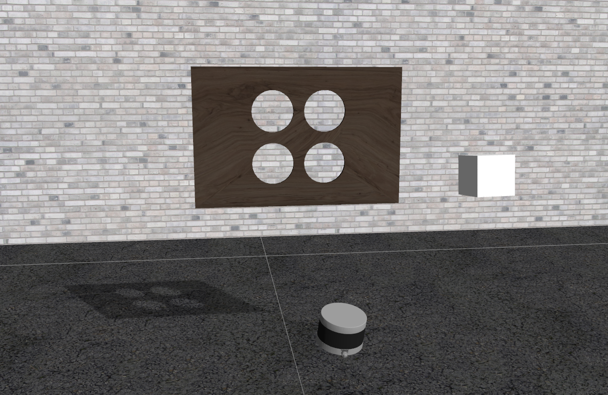
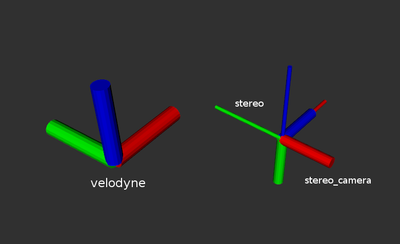
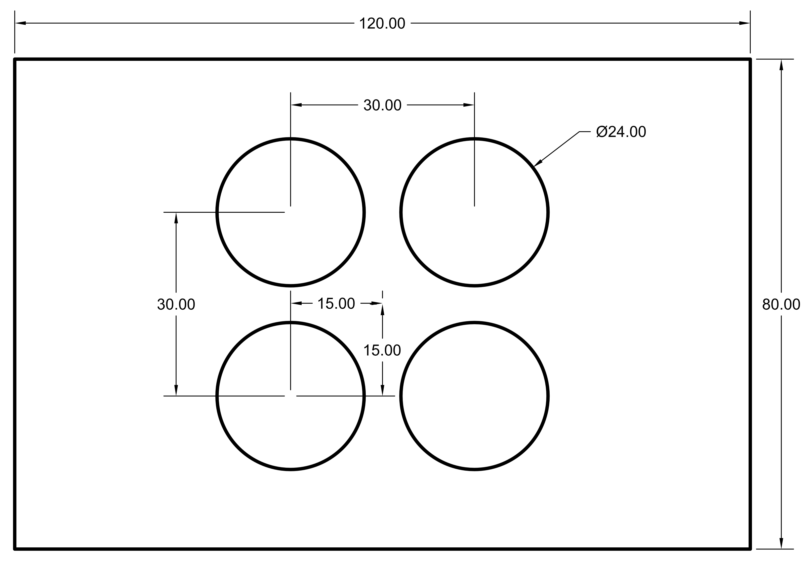

# velo2cam_calibration [](http://build.ros.org/job/Kdev__velo2cam_calibration__ubuntu_xenial_amd64/)

The *velo2cam_calibration* software implements an Automatic Calibration algorithm for Lidar-Stereo camera setups \[1\]. This software is provided as a ROS package.

Package developed at [Intelligent Systems Laboratory](http://www.uc3m.es/islab), Universidad Carlos III de Madrid.



# Nodes #
## stereo_pattern ##
### Subscribed Topics ###
*cloud2* ([sensor_msgs/PointCloud2](http://docs.ros.org/api/sensor_msgs/html/msg/PointCloud2.html))

&nbsp;&nbsp;&nbsp;&nbsp;Stereo camera point cloud containing points belonging to edges in the left image

*cam_plane_coeffs* ([pcl_msgs::ModelCoefficients](http://docs.ros.org/api/pcl_msgs/html/msg/ModelCoefficients.html))

&nbsp;&nbsp;&nbsp;&nbsp;Coefficients of the calibration target plane model
### Published Topics ###
*/stereo_pattern/centers_cloud* ([velo2cam_calibration::ClusterCentroids](http://docs.ros.org/kinetic/api/velo2cam_calibration/html/msg/ClusterCentroids.html))

&nbsp;&nbsp;&nbsp;&nbsp;Target circles centers obtained from stereo camera data

<!-- ### Parameters ### -->
## laser_pattern ##
### Subscribed Topics ###
*cloud1* ([sensor_msgs/PointCloud2](http://docs.ros.org/api/sensor_msgs/html/msg/PointCloud2.html))

&nbsp;&nbsp;&nbsp;&nbsp;LIDAR pointcloud
### Published Topics ###
*/laser_pattern/centers_cloud* ([velo2cam_calibration::ClusterCentroids](http://docs.ros.org/kinetic/api/velo2cam_calibration/html/msg/ClusterCentroids.html))

&nbsp;&nbsp;&nbsp;&nbsp;Target circles centers obtained from LIDAR data
<!-- ### Parameters ### -->
## velo2cam_calibration ##
### Subscribed Topics ###
*~cloud1* ([velo2cam_calibration::ClusterCentroids](http://docs.ros.org/kinetic/api/velo2cam_calibration/html/msg/ClusterCentroids.html))

&nbsp;&nbsp;&nbsp;&nbsp;Target circles centers obtained from LIDAR data

*~cloud2* ([velo2cam_calibration::ClusterCentroids](http://docs.ros.org/kinetic/api/velo2cam_calibration/html/msg/ClusterCentroids.html))

&nbsp;&nbsp;&nbsp;&nbsp;Target circles centers obtained from stereo camera data

*~cloud3* ([sensor_msgs/PointCloud2](http://docs.ros.org/api/sensor_msgs/html/msg/PointCloud2.html))

&nbsp;&nbsp;&nbsp;&nbsp;Original LIDAR pointcloud
### Published Topics ###
TF containing the transformation between both sensors ([see TF info in ROS Wiki](http://wiki.ros.org/tf))

The node broadcasts the TF transformation between *velodyne* and *stereo* frames.
The fixed transformation between *stereo_camera* and *stereo* is published by a static broadcaster in *stereo_pattern.launch*.
The picture below shows the three coordinate frames:



**Note**: Additionally, a .launch file called *calibrated_tf.launch* containing the proper TF broadcasters is created in the */launch* folder of the *velo2cam_calibration* package so
you can use the calibration just executing:

```roslaunch velo2cam_calibration calibrated_tf.launch```

### Parameters ###
As described in the paper, different parameters can be selected. The ones that you will usually need are set in the launch files. For convenience, two sets of launch files are provided, with different parameters intended for the Gazebo environment, on the one hand, or the real wood pattern, on the other hand. The latter have *real_* as a prefix.

# Usage #
Some sample .launch files are provided in this package. The simplest way to launch the algorithm is by running the three main ROS nodes as follows:

```roslaunch velo2cam_calibration laser_pattern.launch```

```roslaunch velo2cam_calibration stereo_pattern.launch```

```roslaunch velo2cam_calibration velo2cam_calibration.launch```

We also provide a launch file containing the three launch files above:

```roslaunch velo2cam_calibration full_calibration.launch```

In order to test the algorithm, you can download an example .bag file [here](https://www.dropbox.com/s/fdvew31azdp9cbg/1_trans_0.bag?dl=1).

**Note**: The .bag file above was generated using a simulator environment in Gazebo which is provided [here](https://github.com/beltransen/velo2cam_gazebo). We use the simulator in order to test the algorithm with a proper ground truth.

# Calibration target details #
The following scheme shows the real size of the calibration target used by this algorithm. Measurements are given in centimeters (cm).



**Note:** Other size may be used for convenience. If so, please configure nodes parameters accordingly.

# Citation #
\[1\] Guindel, C., Beltrán, J., Martín, D. and García, F. (2017). Automatic Extrinsic Calibration for Lidar-Stereo Vehicle Sensor Setups. *IEEE International Conference on Intelligent Transportation Systems (ITSC), 674–679*.

Pre-print available [here](https://arxiv.org/abs/1705.04085).
